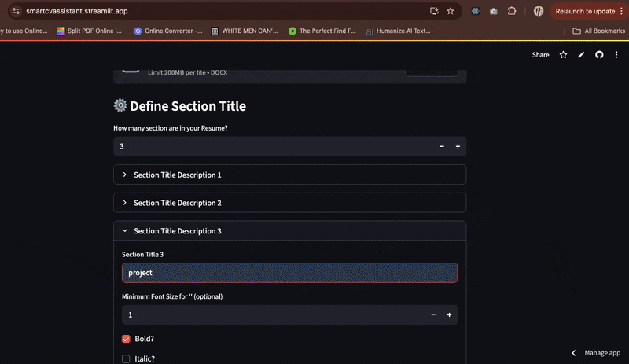

# Resume Reader 
Resume reader is a Streamlit-based web app that allows users to upload a DOCX-format resume, select the various section title and displays the contents of the selected title.



## Features
- Upload `.docx` CVs and detect sections
- Define custom section title styles
- View specific content to include

## Tech Stack
- Python
- Streamlit
- Spire.Doc (via pythonnet)
- re (regex)

## Installation
Clone the repo:
```bash
git clone https://github.com/asogwachiuba/smartCvAssistant.git
cd smartCvAssistant

pip install -r requirements.txt
streamlit run main.py

### **🧪 Usage**
1. Upload your `.docx` resume.
2. Define the rules to detect section headers (e.g., bold, font size).
3. View the items in your CV.
